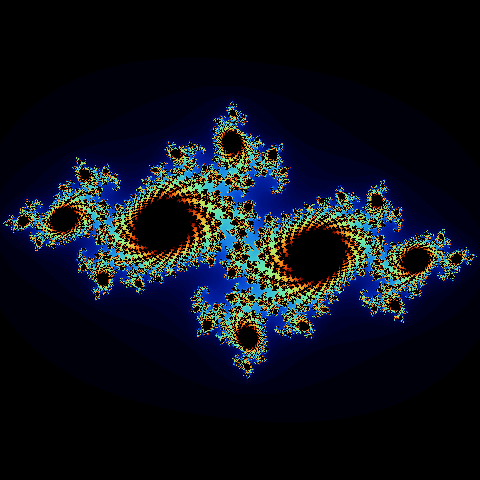

# Exploring MPS + Torch 

MPS is the Apple framework for GPU acceleration and it can be used with PyTorch to accelerate tensor computations on Apple devices.
I've been meaning to explore this for a while and it's pretty cool since the Julia set is a awesome example of a fractal that can be rendered using tensor computations!

This repo has two things: 

1. A simple Julia set renderer that uses MPS + Torch to render a Julia set fractal.
2. A simple notebook that explores some of the limitations of MPS + Torch on matrix multiplication.

